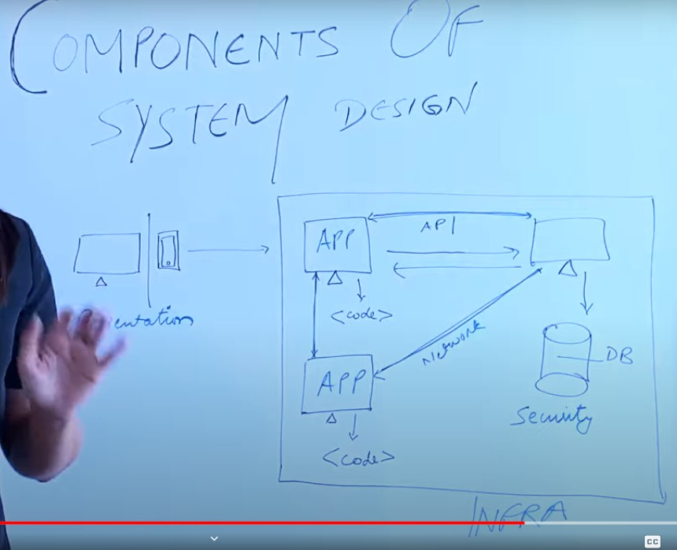
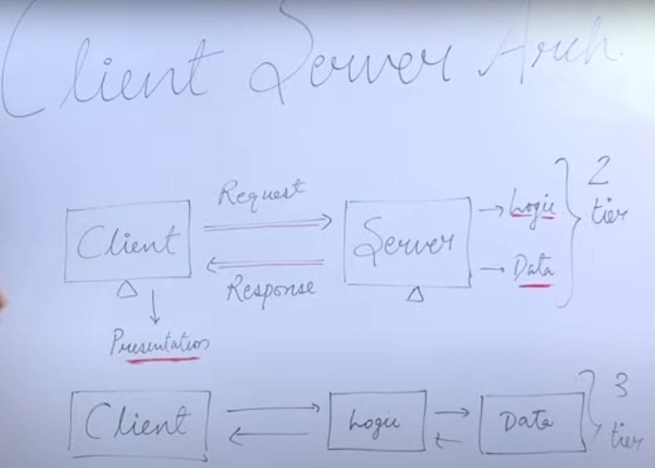
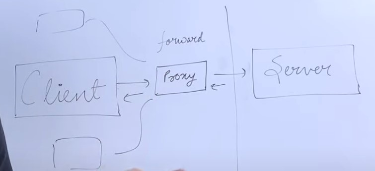
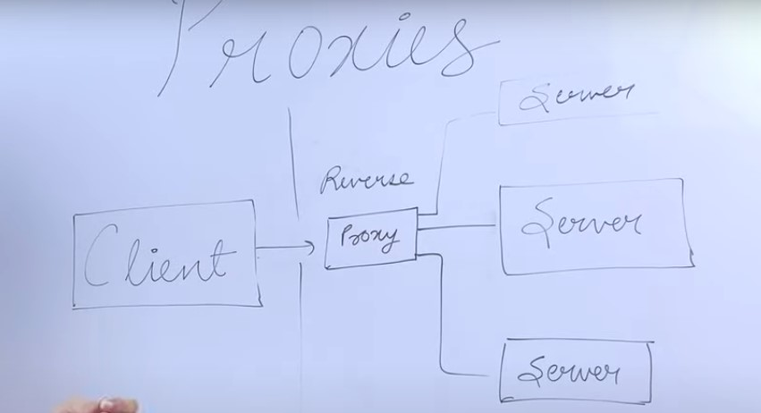

# System Design

**What is System?**
System is a loosely used term for architecture or collection of technologies that serves certain set of users to fulfill certail requirements like whatsapp, facebook, instagram etc.

- Computing systems - netflix

- Real World Systems - Hospital, Police Stations

**What is Design?**
Slecting the components of the systems while keeping in mind requirements of the users.

**Components** - Building Blocks of a system
Two Types of components are:
- Logical Entities
- Tangible Entities(Technology)

**Logical entities**
When we build the system we required databses to store the data and work upon it and in order to connect users to data we require certain application like in the form of mobile apps,websites, desktop apps.
These are the logical entities that make up for the access of the system.

Another Logical Entite is communication protocol like http/tcp/ip etc. which allows components of the system to interact with each other

Similarly applications interact with each other with the help of APIs

Presentation Layers - Layer that user can see like mobile apps, websites etc.

Some applications may have presentation layer or some may not like loggers do not have the presentaiton layer.

Some logical Entities are:-
1. Data
2. Databse
3. Applicaitons
4. Cache
5. Message Queues
6. Infrastrucure
7. Communication Protocols

**Tangible Entities(Technology)**
1. Text, images, videos
2. Monogdb, Mysql
3. Java, goland, python
4. Redis, MemeCache
5. Kafka, RabbitMQ
6. AWS, Azure
7. APIs, RPCs, Messages

  

## **Client Server Architecture**
When the logic and data is on the client side it it 3 -tier architecture and it is called **Thick Client**.
Example: Gaming Apps, Video Editing Softwares

When the logic is on the server side it is called 2-tier architecture and it is called the **thin client**.
Example-: 
E-commerce Sites, Streaming Applicaitons

  

There are N tier architecture and are used when the requirement can not be fulfilled by the client and server only then we introduce some other layers in between like Load Balancers , Chache layer etc.

#### When to use What

- 2 Tier
Light Weight, Websites for small Scale business
- 3 Tier
Basic Library Management for school
- N tier
Large Scale Systems (Gmail , Facebook)

## Proxies
Proxy - On Behalf like attendance
**Forward Proxy**
Machine Which Talks to the server on client behalf. Client Never talks to the server.
- Disguises a cleint's IP address
This is useful for Anonymity server does not know the ip address of the client.

- Block Malicious Traffic from reaching an origin web server

- Improve user's Experience by Caching External Site Content 

In client Server Architecture

  

**Reverse Proxy**
Here Proxy talks to client and proxy server talks to all other servers
- In this case client does not talks to Server Directly
Anonymity of Server is maintained
- Scrubs All incoming Traffic Before it is Sent to the backend servers
- Can Efficeintly Distribute the load for applications using multiple servers
- Can be used for caching the response from servers
- Deflates overall impact of Distributed Denial of services(DDoS) attacks Since our servers are never exposed to the outer worlds.
- Provides a single configuration point to manage SSL/TSL.

  

 
